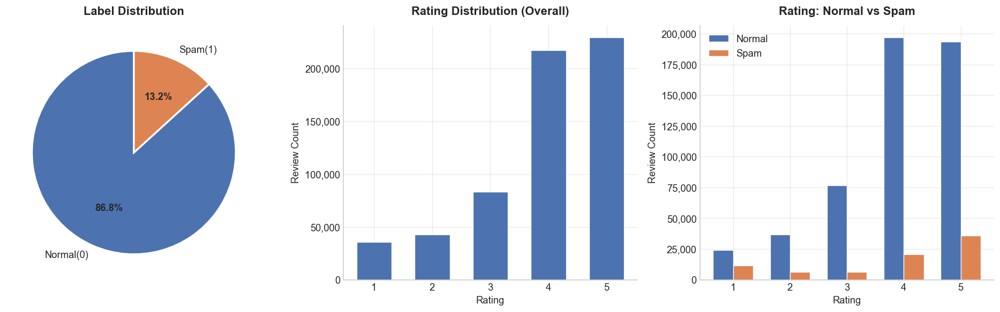
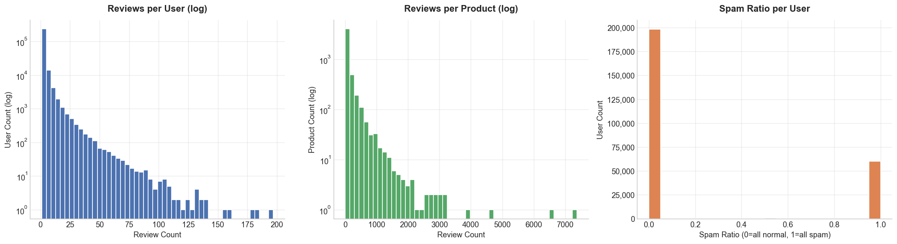
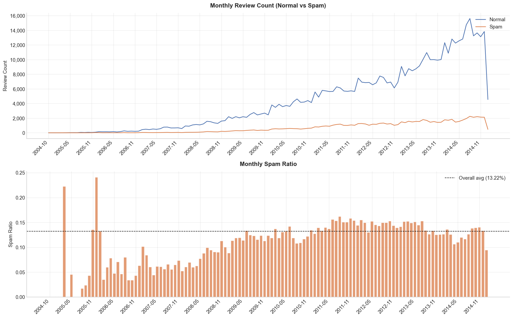
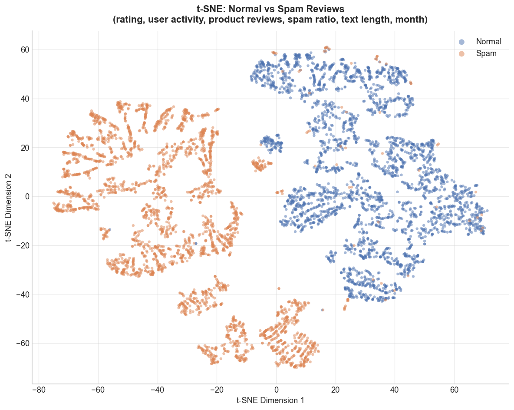
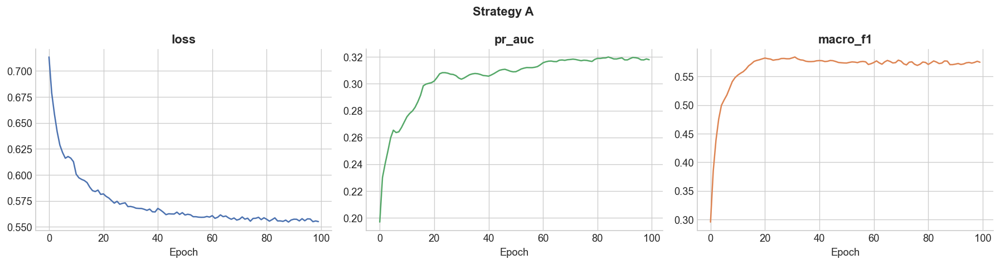
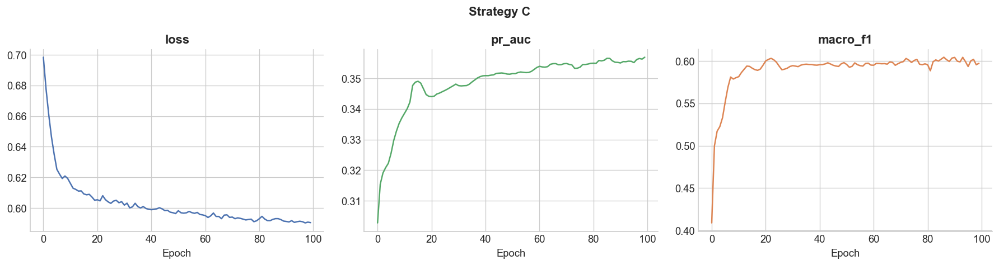

# GNN 기반 사기 리뷰 탐지 네트워크 분석 프로젝트 보고서

---

## 1. 프로젝트 목적

온라인 플랫폼의 Yelp 리뷰 데이터에서 발생하는 사기 리뷰(스팸)를 탐지하는 것을 목표로 한다. 개별 리뷰의 정보만으로는 파악하기 어려운 사기 리뷰를 관계망(그래프)으로 표현하고 GNN을 활용하여 사기 리뷰 탐지 성능을 검증하는 실험을 수행한다.

---

## 2. 데이터 분석 및 전처리

### 2-1. 사용 데이터

**YelpZip 데이터셋** (Kaggle)

| 항목 | 내용 |
|---|---|
| 전체 리뷰 수 | 608,458건 |
| 정상 리뷰 | 528,019건 (86.8%) |
| 사기 리뷰 | 80,439건 (13.2%) |
| 수집 기간 | 2004년 10월 - 2015년 초 |
| 결측치 | 없음 |
| 주요 컬럼 | user_id, prod_id, rating, label, date, text, tag |

**라벨 분포 및 별점 분포**



전체 데이터의 86.8%가 정상, 13.2%가 사기 리뷰로 클래스 불균형이 명확하다. 별점 분포에서 사기 리뷰는 정상 리뷰 대비 1점과 5점의 극단 별점 비율이 상대적으로 높게 나타난다.

**사용자 / 상품 활동량 분포**



사용자별 리뷰 수, 상품별 리뷰 수 모두 전형적인 파워 로우 분포를 따른다. 특히 사용자별 사기 리뷰 비율 분포가 0과 1 양 극단에서만 높게 나타나는 이중 피크(bimodal) 형태를 보이며, 이는 사기 리뷰 전용 계정의 존재를 시사한다.

**시간별 리뷰 분포**



정상-사기 리뷰 모두 2004년부터 꾸준히 증가하며, 2012년 전반기를 중심으로 전체 평균(13.22%)을 상회하는 스팸 비율이 지속된 구간이 확인된다.

**t-SNE 시각화**



수치 피처 6개 기반 t-SNE 결과. 완전한 분리가 이루어지지는 않으나 수치 피처만으로도 그래프 구조를 활용한 사기 리뷰 탐지의 가능성을 확인할 수 있으며, 텍스트 임베딩 추가 시 분리도가 크게 향상될 것으로 기대된다.

---

### 2-2. 전처리 방법

**라벨 변환 (필수)**

원본 데이터의 라벨 체계를 학습 표준 형식으로 변환한다.

- 변환 전: 정상 `1` / 사기 `-1`
- 변환 후: 정상 `0` / 사기 `1`

**샘플링 전략**

전체 60만 건을 한 번에 처리하기 어려워 두 가지 샘플링 전략을 적용하여 비교 실험을 수행한다. 각 전략 내에서 stratified 분할로 스팸 비율을 유지한다.

| 전략 | 방법 | 노드 수 | 스팸 비율 |
|---|---|---|---|
| Strategy A | 리뷰 집중 상위 13개 상품 기준 필터링 | 48,608건 | 11.33% |
| Strategy C | 스팸 비율 피크 구간 (2012.01-06) 필터링 | 48,586건 | 14.59% |

Strategy C의 기간은 EDA의 월별 스팸 비율 분포에서 15-16%로 전체 평균(13.22%) 대비 지속적으로 가장 높게 나타난 구간으로 선정한다. 두 전략 모두 적정 샘플링 범위(10,000-50,000 노드) 내에 해당한다.

**데이터 분할**

샘플링 이후에 stratified 분할을 적용하여 스팸 비율을 유지한다.

- 학습: 80% / 테스트: 20%
- random_state: 42

### 2-3. 노드 피처 및 엣지 설계

**노드 피처 (5개)**

| 피처 | 내용 | 설계 이유 |
|---|---|---|
| rating | 리뷰 별점 (1-5) | 사기 리뷰는 1점과 5점의 극단 별점 집중 현상 확인 (EDA) |
| user_cnt | 해당 사용자의 전체 리뷰 수 | 작업장의 집중적 활동량 반영 |
| prod_cnt | 해당 상품의 전체 리뷰 수 | 리뷰 집중 상품이 작업장의 주요 타겟일 가능성 반영 |
| text_len | 리뷰 텍스트 길이 | 사기 리뷰의 짧거나 획일적인 텍스트 탐지 반영 |
| month | 리뷰 작성 월 | 특정 시기 집중 활동 패턴 반영 |

모든 피처는 StandardScaler로 정규화한다.

**엣지 설계**

*R-U-R (Review-User-Review): 핵심 Relation*

같은 사용자가 작성한 리뷰끼리 연결한다. EDA에서 사용자별 사기 리뷰 비율 분포가 0과 1 양 극단에서만 높게 나타나는 이중 피크(bimodal) 형태를 보이며, 이는 사기 리뷰가 전용 계정으로 작성된다는 점을 보여준다. R-U-R 엣지가 가장 강한 구별 신호를 제공할 것으로 예상한다. 엣지 폭발 방지를 위해 그룹당 최대 30개 노드로 샘플링한다.

*R-S-R (Review-Star-Review): 보완 Relation*

같은 상품에 같은 별점을 남긴 리뷰끼리 연결한다. EDA에서 사기 리뷰는 1점과 5점의 극단 별점 비율이 정상 리뷰 대비 상대적으로 높게 나타난다. 경쟁 업체 공격(1점 테러)과 특정 업체 띄우기(5점 도배)가 같은 별점 연결자를 통해 사기 탐지에 활용된다.

---

## 3. 모델 설계 및 학습

### 3-1. 선택한 모델

GCN (Graph Convolutional Network) - 2-layer

### 3-2. 모델 선택 이유

GCN은 GNN 계열의 가장 기본적인 구조로 이웃 노드의 정보를 집계하여 노드 표현을 학습한다. 본 실험에서는 엣지 설계, 노드 피처 구성, 기본 그래프 기반 모델로서의 베이스라인 성능을 측정하기 위한 출발점 모델로 선택한다.

### 3-3. 모델 구조 및 학습 설정

```
입력 (5 features)
  -> GCNConv(5 -> 64) + ReLU + Dropout(0.5)
  -> GCNConv(64 -> 64) + ReLU + Dropout(0.5)
  -> Linear(64 -> 2)
```

| 항목 | 값 |
|---|---|
| Optimizer | Adam (lr=0.01, weight_decay=5e-4) |
| Epochs | 100 |
| Loss | CrossEntropy |
| 클래스 불균형 대응 | class_weight = [1.0, n_normal / n_spam] |

클래스 불균형(86:14)을 대응하기 위해 사기 클래스에 높은 가중치를 부여한다.

---

## 4. 모델 학습 결과 및 결과 해석

### 4-1. 평가 지표

- **PR-AUC**: 클래스 불균형 상황에서 사기 리뷰 판별 능력 측정
- **Macro F1**: 클래스별 F1의 단순 평균으로 소수 클래스 탐지 성능을 균등 반영

### 4-2. 모델 학습 결과

| 전략 | 노드 수 | 엣지 수 | 스팸 비율 | PR-AUC | Macro F1 |
|---|---|---|---|---|---|
| Strategy A (Top 13 Products) | 48,608 | 50,521 | 11.33% | 0.3179 | 0.5747 |
| Strategy C (2012.01-06) | 48,586 | 350,167 | 14.59% | **0.3569** | **0.5973** |

**Strategy A 학습 곡선 요약**



- Loss: 0.71 -> 0.555 수렴 / PR-AUC: 0.32 정점 / Macro F1: 0.57 plateau

**Strategy C 학습 곡선**



- Loss: 0.70 -> 0.59 수렴 (A 대비 더 안정적으로 감소)
- PR-AUC: epoch 20 근처에서 0.35 수준으로 빠르게 상승 후 100 epoch까지 꾸준히 유지
- Macro F1: epoch 20 이후 0.59 근방에서 0.60 수준으로 안정

### 4-3. 결과 해석

#### 전략 성능 비교

| 지표 | Strategy A | Strategy C | 변화 |
|---|---|---|---|
| PR-AUC | 0.3179 | 0.3569 | **+12.3%** |
| Macro F1 | 0.5747 | 0.5973 | **+3.9%** |
| 엣지 수 | 50,521 | 350,167 | +593% |
| 스팸 비율 | 11.33% | 14.59% | +3.26%p |

#### 왜 Strategy C가 더 우수한가

**더 풍부한 그래프 연결의 차이**

Strategy C의 R-S-R 엣지가 283,175개로 A(27,874개) 대비 약 10배 이상 많다. 이는 특정 기간(2012.01-06)에 같은 상품에 같은 별점을 집중적으로 남기는 작업장 활동 패턴이 풍부한 연결자로 반영되었기 때문이다. GCN이 이웃 노드 정보를 집계하여 학습하기 때문에 그래프가 밀집될수록 사기 신호가 더 잘 전파되어 탐지 성능이 향상된다.

**더 균일한 학습 데이터의 스팸 비율**

Strategy C는 EDA에서 확인된 스팸 비율 피크 구간(월별 스팸 비율 14-16%)을 기준으로 선정하여 해당 구간 내 스팸 비율이 14.59%로 A(11.33%) 대비 높다. 모델의 학습 과정에서 더 많은 사기 리뷰 샘플을 접한다.

**더 안정적인 학습 수렴 특성**

A는 epoch 20 이전에 대부분의 plateau를 형성하는 반면, C는 100 epoch까지 PR-AUC가 꾸준히 향상된다. 이는 C의 그래프가 더 풍부한 구조를 가지고 있어 모델이 충분히 학습하지 못해도 점진적인 성능 향상이 가능하다는 것을 시사한다. epoch 수를 늘리거나 학습률을 조정하면 추가 성능 향상 여지가 있다.

#### 베이스라인으로서의 의의

두 전략 모두 텍스트 임베딩 없이 수치 피처 5개와 기본 엣지 2종류만으로 구성된 최소 베이스라인 모델에서도 PR-AUC 0.32-0.36, Macro F1 0.57-0.60을 달성한다. 이는 단순 수치 피처만으로도 그래프 구조를 활용한 사기 리뷰 탐지의 가능성을 입증하는 결과이며, 텍스트 임베딩과 다양한 엣지가 추가된 고도화 모델에서 성능이 크게 향상될 것으로 기대된다.

---

## 5. 모델 기반 인사이트 및 향후 방향

**사용자 행동 패턴의 발견**

사용자별 사기 리뷰 비율이 0과 1 양 극단에서만 집중되는 이중 피크 분포. 사기 리뷰 전용 계정이 존재하며 대부분 100% 사기 리뷰만 작성한다는 것을 의미한다. 이 관점에서 사기 비율이 높은 사용자 계정을 조기 탐지하는 시스템의 설계가 가능하다.

**상품 집중 활동 패턴**

상위 13개 상품에 48,608개의 리뷰가 집중되는 현상이 확인된다. 이런 집중 리뷰 상품이 작업장의 주요 타겟이므로 전체 시스템에서 의심 상품을 조기 탐지하여 집중 모니터링하는 방법이 유효하다.

**시간 기반 사기 집중 구간**

2012년 1-6월이 월별 스팸 비율이 전체 평균(13.22%) 대비 지속적으로 가장 높은 구간(14-16%)이다. 이러한 시간 집중 패턴은 특정 시기의 작업장이 집중 운영됨을 시사하며, 시간 기반 조기 탐지 시스템의 설계가 가능하다.

**별점 극단화 패턴**

사기 리뷰는 1점과 5점 별점 집중 현상, 경쟁 업체 공격(1점 테러)과 특정 업체 띄우기(5점 도배)가 같은 별점 연결자(R-S-R)를 통해 사기 탐지에 활용된다.

---

## 6. 모델로서의 한계와 발전 방향

**현재 한계**

1. **텍스트 임베딩 미사용**: 수치 피처만을 사용하여 리뷰 텍스트의 의미 정보를 반영하지 못한다. t-SNE 시각화에서 수치 피처만으로는 완전한 분리가 이루어지지 않음을 확인.
2. **기본 엣지만 사용**: R-U-R, R-S-R 엣지 외 다양한 엣지 유형 미적용.
3. **GCN의 구조적 한계**: 이웃 노드의 정보를 단순 평균으로 집계하여 중요한 이웃과 덜 중요한 이웃을 구별하지 못한다.

**발전 방향**

1. BERT 또는 TF-IDF 기반 텍스트 임베딩을 노드 피처로 추가
2. 다양한 엣지 유형 설계 (텍스트 유사도 기반 R-V-R, 시간 인접 기반 엣지 등)
3. GAT 또는 GraphSAGE로 모델 고도화
4. 두 전략(A, C) 비교 결과를 바탕으로 최적 전략 선정
